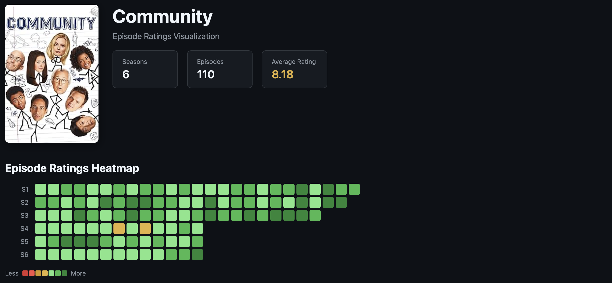
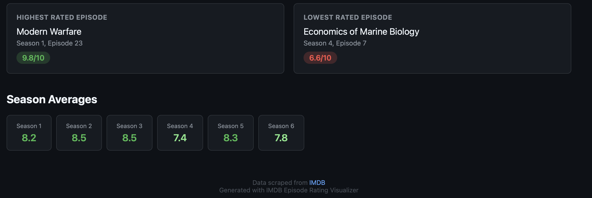

# IMDB Episode Rating Visualizer

A CLI tool that scrapes IMDB for TV show episode ratings and generates a beautiful static HTML page with a GitHub-style heatmap visualization.

## Features

- **Scrape any TV show** - Just provide the IMDB URL
- **GitHub-style heatmap** - Visual grid showing all episodes across all seasons
- **Color-coded ratings** - Red (low) → Yellow (mid) → Green (high)
- **Analytics** - Min/max episodes, season averages, overall stats
- **Self-contained output** - Single HTML file with inline CSS, easy to share
- **Dark theme** - Easy on the eyes

## Tech Stack

- **Python 3.x** - Core language
- **requests** - HTTP requests to IMDB
- **BeautifulSoup4** - HTML parsing and scraping
- **Jinja2** - HTML template rendering
- **argparse** - CLI argument parsing

## Installation

```bash
# Clone the repository
git clone https://github.com/yourusername/imdb-classifier.git
cd imdb-classifier

# Install dependencies
pip install -r requirements.txt
```

## Usage

```bash
# Basic usage - provide IMDB show URL
python imdb_scraper.py "https://www.imdb.com/title/tt0903747/"

# Custom output filename
python imdb_scraper.py "https://www.imdb.com/title/tt0903747/" --output breaking_bad.html
```

### Example Output

The tool generates a static HTML file in the `output/` directory with:
- Show poster and title
- Heatmap grid of all episodes
- Hover tooltips with episode names and ratings
- Analytics summary (best/worst episodes, averages)




## How It Works

1. **Scraping** - Fetches the show's main page and all season pages from IMDB
2. **Parsing** - Extracts show metadata (name, poster) and episode ratings using BeautifulSoup
3. **Analytics** - Calculates min/max episodes, season averages, and overall statistics
4. **Rendering** - Uses Jinja2 to generate a styled HTML page with the heatmap visualization
5. **Output** - Saves a self-contained HTML file ready to open in any browser

## Color Scale

| Rating | Color |
|--------|-------|
| 1-4 | Red |
| 5-6 | Yellow/Orange |
| 7-8 | Light Green |
| 9-10 | Bright Green |

## Project Structure

```
imdb-classifier/
├── imdb_scraper.py      # Main CLI entry point + scraper logic
├── templates/
│   └── ratings.html     # Jinja2 template for output
├── assets/              # Sample output screenshots
├── requirements.txt     # Python dependencies
├── README.md            # This file
└── output/              # Generated HTML files
```

## License

MIT
